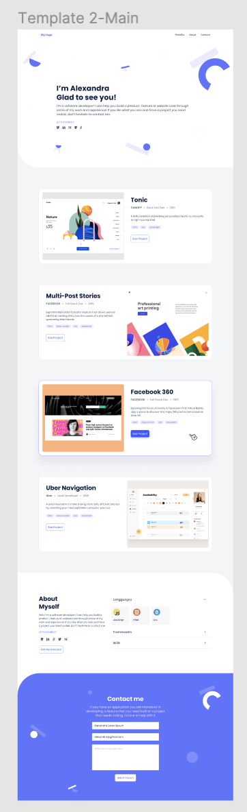

# portfolio desktop project

This project is the desktop version of my portfolio. The figma sample is attached below.


## Built With
- HTML
- CSS

## Getting Started

To get a local copy up and running follow these simple example steps.

### Prerequisites

Webbrowser and access to internet

### Install

1) Clone the repository to your machine;

```sh
$ git clone https://github.com/jbrime15/portfolio-desktop-version.git
```

2) Navigate to the project folder and execute the "index.html" file.

## Author

👤 **JUBRIL IBRAHIM**

- GitHub: [@jbrime15](https://github.com/jbrime15)

## Show your support

Give a ⭐️ if you like this project!

## Acknowledgments

- Microverse

## 📝 License

This project is [MIT](./MIT.md) licensed.